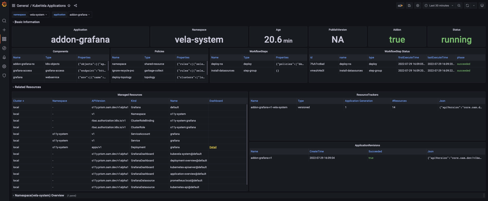
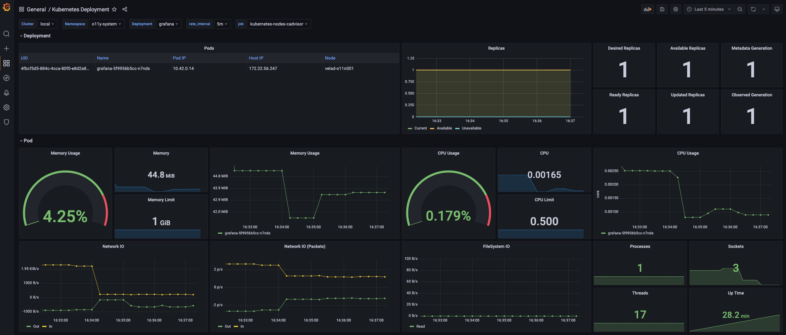
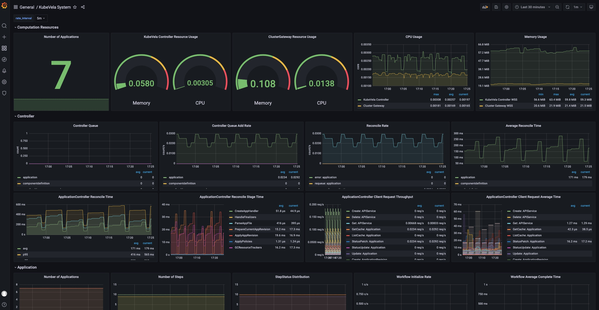
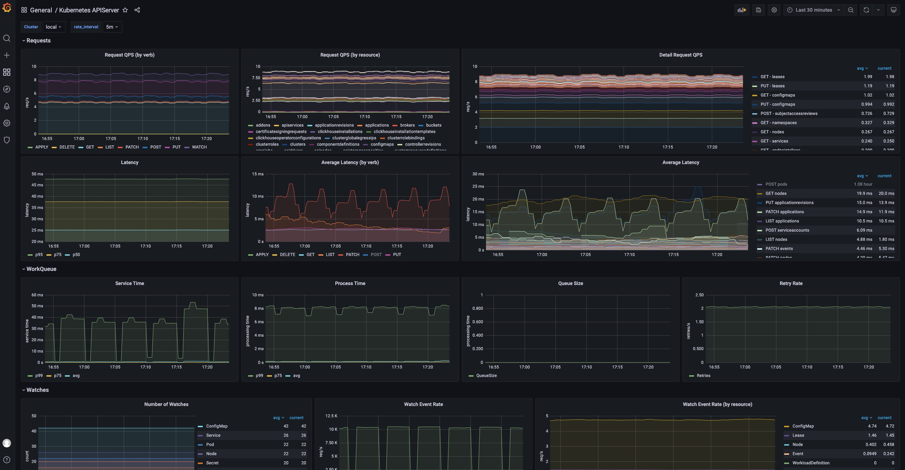

Observability is critical for infrastructures. Without observability system, it is hard to identify what happens when system broke down. On contrary, a strong observabilty system can not only provide confidences for operators but can also help developers quickly locate the performance bottleneck or the weak points inside the whole system.

To help users build their own observability system, KubeVela provides a list of addons, including
- prometheus-server: A server records metrics in time series with flexible queries supported.
- kube-state-metrics: A metrics collector for the Kubernetes system.
- node-exporter: A metrics collector for the running Kubernetes nodes.
- grafana: A web application that provides analytics and interactive visualizations.

More addons for logging and tracing will be introduced in later versions.

## Prerequisite

1. The observability suite includes several addons which requires some computation resources to work properly. The recommended installation resources for you cluster is 2 core + 4 Gi memory.

2. The required KubeVela version (both Server-side controller and Client-side CLI) for installation is **not below ** v1.5.0-beta.4.

<!-- 
3. If you want to use multi-cluster features, make sure you have installed KubeVela with multi-cluster enabled and your managed clusters already joined into KubeVela. See [multi-cluster](../system-operation/managing-clusters) documentation for details.

> The multi-cluster observability currently requires your managed clusters to be able to create LoadBalancer typed service and the LoadBalancer service should be accessible from the hub control plane.

> If you add clusters after the observability addons installed, the addons will not automatically be installed to the new joined cluster.
-->

## Quick Start

To enable the addon suites, you simply needs to run the `vela addon enable` commands as below.

> If your KubeVela is multi-cluster scenario, see the [multi-cluster installation](#multi-cluster-installation) section below.

1. Install the kube-state-metrics addon
```shell
> vela addon enable kube-state-metrics
```

2. Install the node-exporter addon
```shell
> vela addon enable node-exporter
```

3. Install the prometheus-server
```shell
> vela addon enable prometheus-server
```

4. Install the grafana addon.
```shell
> vela addon enable grafana
```

5. Access your grafana through port-forward.
```shell
> kubectl port-forward svc/grafana -n o11y-system 8080:3000
```

Now you can access your grafana by access `http://localhost:8080` in your browser. The default username and password are `admin` and `kubevela` respectively.

## Internal Dashboards

There are four internal dashboards you can navigate and view your system.

### KubeVela Application

This dashboard shows the basic information for one application.

URL: http://localhost:8080/d/application-overview/kubevela-applications



### Kubernetes Deployemnt

This dashboard shows the overview of native deployments. You can navigate deployments across clusters.

URL: http://localhost:8080/d/deployment-overview/kubernetes-deployment



### KubeVela System

This dashboard shows the overview of the KubeVela system. It can be used to see if KubeVela controller is healthy.

URL: http://localhost:8080/d/kubevela-system/kubevela-system



### Kubernetes APIServer

This dashboard shows the running status of all Kubernetes apiservers.

URL: http://localhost:8080/d/kubernetes-apiserver/kubernetes-apiserver



## Customization

The above installation process can be customized in several ways.

### Multi-cluster installation

If you want to install observability addons in multi-cluster scenario, make sure your Kubernetes clusters support LoadBalancer service and are mutatually accessible.

By default, the installation process for `kube-state-metrics`, `node-exporter` and `prometheus-server` are natually multi-cluster supported (they will be automatically installed to all clusters). But to let your `grafana` on the control plane to be able to access prometheus-server in managed clusters, you need to use the following command to enable `prometheus-server`.

```shell
> vela addon enable prometheus-server thanos=true serviceType=LoadBalancer
```

This will install [thanos](https://github.com/thanos-io/thanos) sidecar & query along with prometheus-server. Then enable grafana, you will be able to see aggregated prometheus metrics now.

You can also choose which clusters to install addons by using commands as below

```shell
> vela addon enable kube-state-metrics clusters=\{local,c2\}
```

> If you add new clusters to your control plane after addons being installed, you need to re-enable the addon to let it take effect.

### Custom Prometheus configuration

If you want to make customization to your prometheus-server installation, you can put your configuration into a individual ConfigMap, like `my-prom` in namespace o11y-system. To distribute your custom config to all clusters, you can also use a KubeVela Application to do the job.

#### Recording rules

For example, if you want to add some recording rules to all your prometheus server configurations in all clusters, you can firstly create an application to distribute your recording rules as below.

```yaml
# my-prom.yaml
apiVersion: core.oam.dev/v1beta1
kind: Application
metadata:
  name: my-prom
  namespace: o11y-system
spec:
  components:
  - type: k8s-objects
    name: my-prom
    properties:
      objects:
      - apiVersion: v1
        kind: ConfigMap
        metadata:
          name: my-prom
          namespace: o11y-system
        data:
          my-recording-rules.yml: |
            groups:
            - name: example
              rules:
              - record: apiserver:requests:rate5m
                expr: sum(rate(apiserver_request_total{job="kubernetes-nodes"}[5m]))
  policies:
  - type: topology
    name: topology
    properties:
      clusterLabelSelector: {}
```

Then you need to add `customConfig` parameter to the enabling process of the prometheus-server addon, like
```shell
> vela addon enable prometheus-server thanos=true serviceType=LoadBalancer storage=1G customConfig=my-prom
```

Then you will be able to see the recording rules configuration being delivered into all prome

#### Alerting rules & Other configurations

To make customization to other configurations like alerting rules, the process is same with the recording rules example shown above. You only need to change/add prometheus configurations in the application.

```yaml
data:
  my-alerting-rules.yml: |
    groups:
    - name: example
      rules:
      - alert: HighApplicationQueueDepth
        expr: sum(workqueue_depth{app_kubernetes_io_name="vela-core",name="application"}) > 100
        for: 10m
        annotations:
          summary: High Application Queue Depth
```

### Customize Grafana credential

If you want to change the default username and password for Grafana, you can run the following command
```shell
> vela addon enable grafana adminUser=super-user adminPassword=PASSWORD
```

This will change your default admin user to `super-user` and its password to `PASSWORD`.

### Custom storage

If you want your prometheus-server and grafana to persist data in volumes, you can also specify `storage` parameter for your installation, like

```shell
> vela addon enable prometheus-server storage=1G
```

This will create PersistentVolumeClaims and let the addon use the provided storage. The storage will not be automatically recycled even if the addon is disabled. You need to clean up the storage manually.

## Integrate other Prometheus & Grafana

Sometimes, you might already have Prometheus & Grafana instances. They might be built by other tools, or come from cloud providers. Follow the below guide to integrate with existing systems.

### Integrate Prometheus

If you already have external prometheus service and you want to connect it to Grafana (established by vela addon), you can create a GrafanaDatasource to register it through KubeVela application.

```yaml
apiVersion: core.oam.dev/v1beta1
kind: Application
metadata:
  name: register-prometheus
spec:
  components:
  - type: grafana-datasource
    name: my-prometheus
    properties:
      access: proxy
      basicAuth: false
      isDefault: false
      name: MyPrometheus
      readOnly: true
      withCredentials: true
      jsonData:
        httpHeaderName1: Authorization
        tlsSkipVerify: true
      secureJsonFields:
        httpHeaderValue1: <token of your prometheus access>
      type: prometheus
      url: <my-prometheus url>
```

### Integrate Grafana

If you already have existing Grafana, // TODO

## Comparisons

### Compared with Helm

Although it is possible to install these resources into your Kubernetes system through Helm, one of the major benefits for using KubeVela addon to install them is that it supports multi-cluster delivery natively, which means, once you add your managed clusters into the KubeVela control plane, you would be able to install, upgrade or uninstall these addons in all clusters through one line.

### Compared with old KubeVela observability addon (version <= v1.4)

The old [KubeVela observability addon](https://github.com/kubevela/catalog/tree/master/experimental/addons/observability) install prometheus, grafana and other widgets as a whole. The latest observability addon suites divides it into multiple parts, which allows users to only install part of the suite.

Besides, the old observability addon relies on the fluxcd addon to install the widgets as Helm release. The latest version, uses the native webservice component in KubeVela, which allows more flexible customizations.
